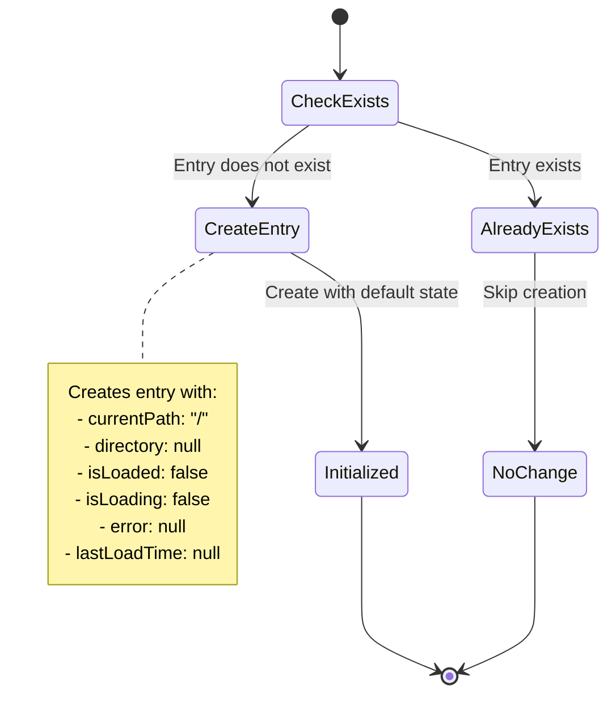
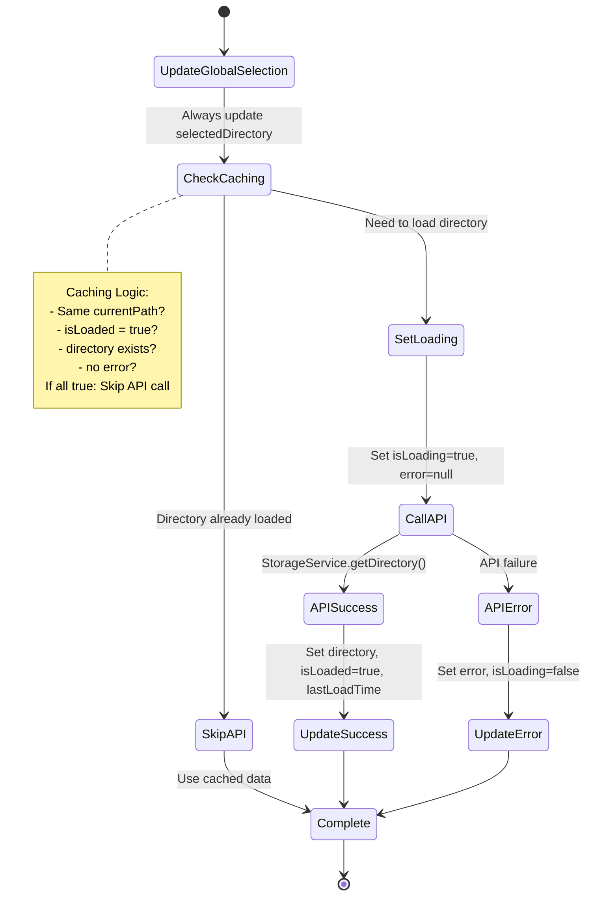
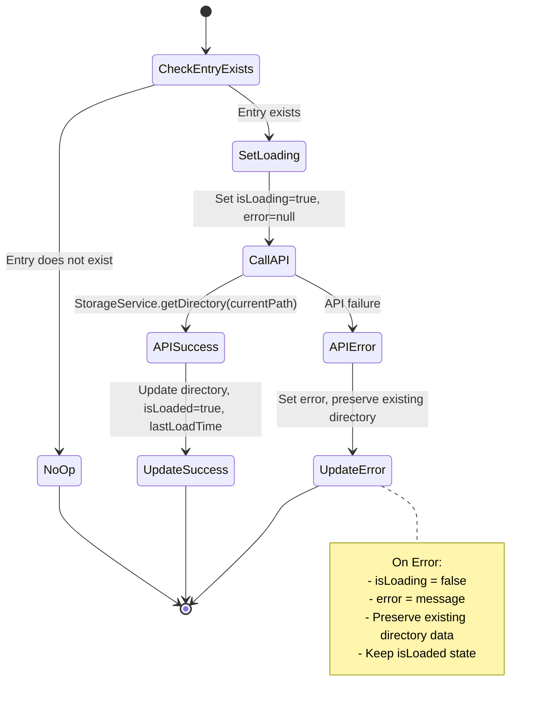
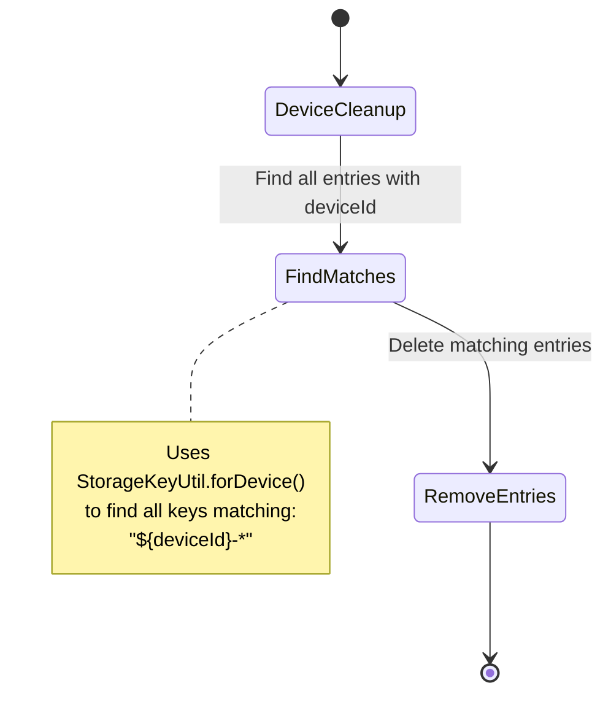
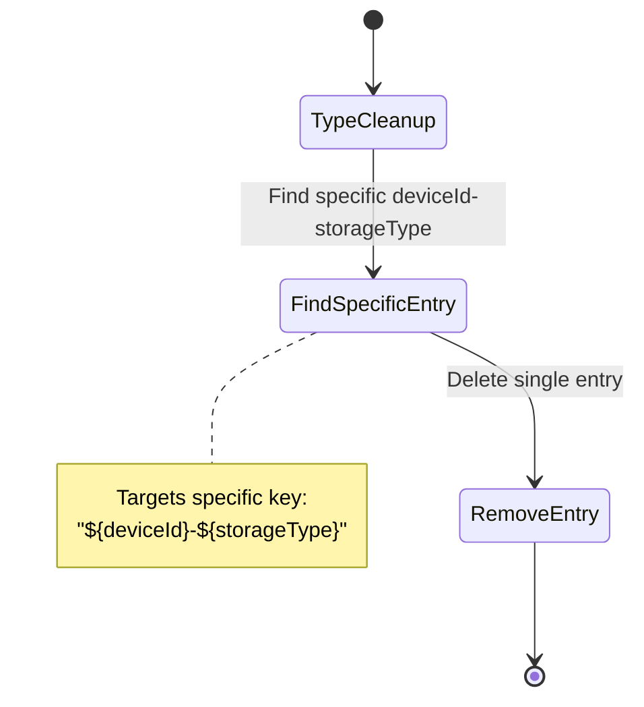
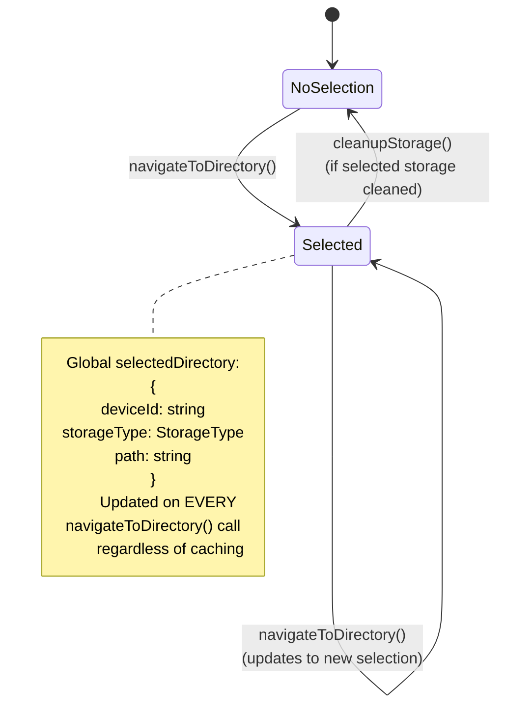
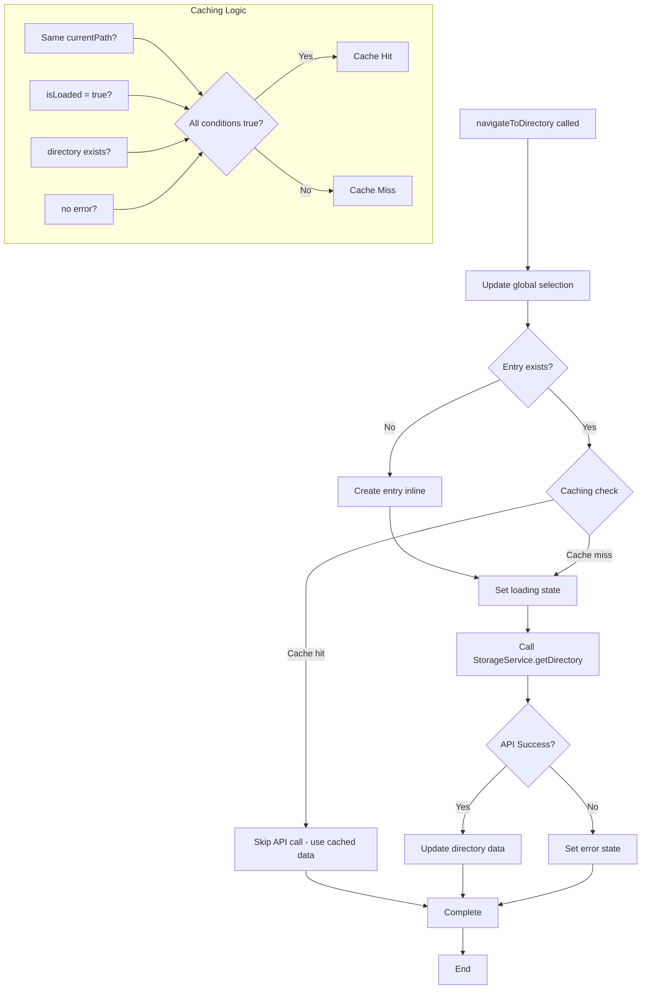
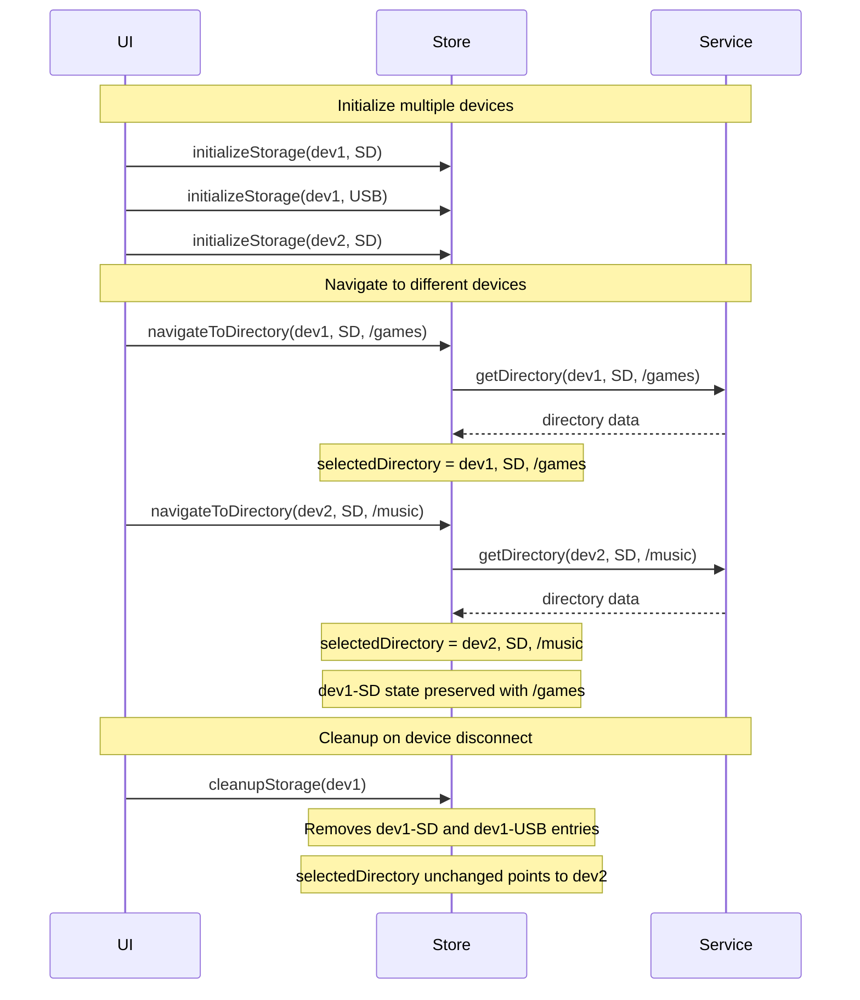
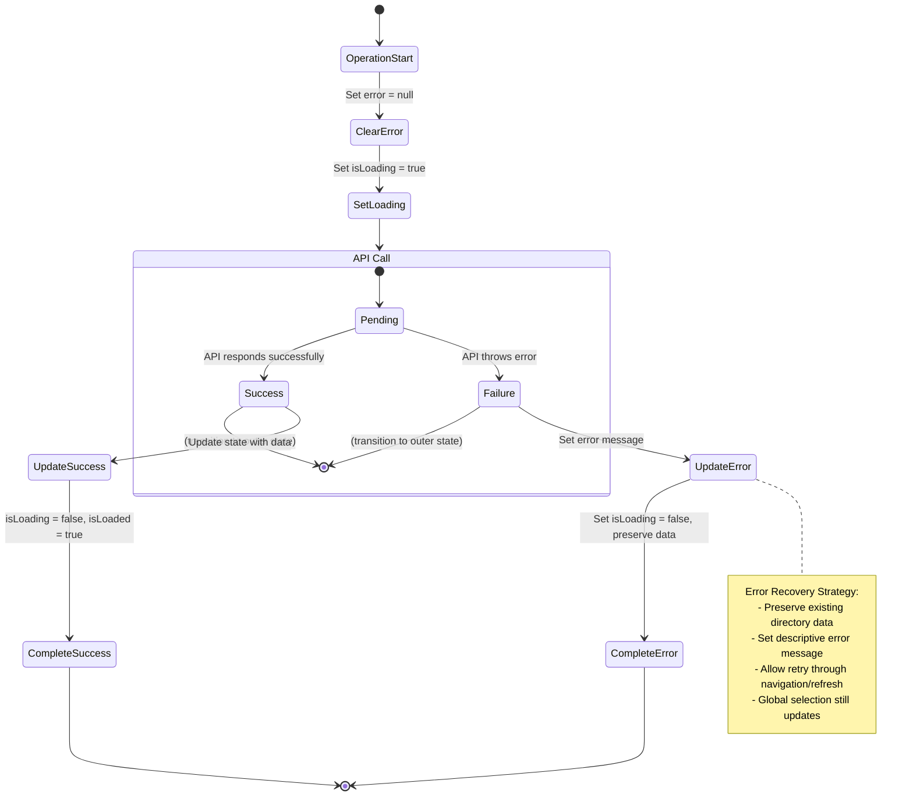

# Storage State Machine Documentation

This document provides comprehensive state machine diagrams for the StorageStore, illustrating how each method transitions state and manages the dual-state architecture.

## Overview

The StorageStore implements a **dual-state architecture**:

- **Local State**: Per device-storage combination using flat keys (`${deviceId}-${storageType}`)
- **Global State**: Single `selectedDirectory` across all devices for UI highlighting

## State Properties Reference

### StorageDirectoryState

```typescript
interface StorageDirectoryState {
  deviceId: string; // Device identifier
  storageType: StorageType; // SD or USB
  currentPath: string; // Current directory path
  directory: StorageDirectory | null; // Loaded directory data
  isLoaded: boolean; // Successfully loaded from API
  isLoading: boolean; // Currently loading from API
  error: string | null; // Last error message
  lastLoadTime: number | null; // Timestamp of last successful load
}
```

### SelectedDirectory

```typescript
interface SelectedDirectory {
  deviceId: string; // Selected device
  storageType: StorageType; // Selected storage type
  path: string; // Selected directory path
}
```

### StorageState

```typescript
interface StorageState {
  storageEntries: Record<StorageKey, StorageDirectoryState>; // Flat key structure
  selectedDirectory: SelectedDirectory | null; // Global selection
}
```

## Key Design Decisions

### Flat State Structure

- **Reason**: O(1) lookups for device-storage combinations
- **Key Format**: `${deviceId}-${storageType}` (e.g., "device123-SD")
- **Benefit**: Scales efficiently with multiple devices

### Dual-State Architecture

- **Local State**: Independent navigation per device-storage
- **Global State**: Single UI selection across all devices
- **Benefit**: Supports complex multi-device UI requirements

### Smart Caching

- **Strategy**: Avoid redundant API calls for already-loaded directories
- **Logic**: Check path, loaded state, data existence, and error state
- **Benefit**: Improved performance and reduced server load

### Inline Entry Creation

- **Pattern**: `navigateToDirectory()` creates storage entries if they don't exist
- **Reason**: Simplifies component usage - no explicit initialization required
- **Trade-off**: Less explicit but more convenient

## Complete Storage Entry State Machine

```mermaid
stateDiagram-v2
    [*] --> Empty

    Empty --> Initialized : initializeStorage()

    state "Storage Entry Lifecycle" as StorageEntry {
        state "Initialized" as Initialized {
            Initialized --> Loading : navigateToDirectory()<br/>(needs API call)
            Initialized --> Initialized : navigateToDirectory()<br/>(already loaded - cached)
        }

        state "Loading" as Loading {
            Loading --> Loaded : API Success
            Loading --> Error : API Error
        }

        state "Loaded" as Loaded {
            Loaded --> Loading : navigateToDirectory()<br/>(different path)
            Loaded --> Loading : refreshDirectory()
            Loaded --> Loaded : navigateToDirectory()<br/>(same path - cached)
        }

        state "Error" as Error {
            Error --> Loading : navigateToDirectory()
            Error --> Loading : refreshDirectory()
        }
    }

    Initialized --> [*] : cleanupStorage()
    Loading --> [*] : cleanupStorage()
    Loaded --> [*] : cleanupStorage()
    Error --> [*] : cleanupStorage()

    note right of StorageEntry
        Local State Properties:
        - deviceId: string
        - storageType: StorageType
        - currentPath: string
        - directory: StorageDirectory | null
        - isLoading: boolean
        - isLoaded: boolean
        - error: string | null
        - lastLoadTime: number | null
    end note
```

## Method-Specific State Diagrams

### 1. initializeStorage()



### 2. navigateToDirectory()



### 3. refreshDirectory()



### 4. cleanupStorage()





## Global Selection State Machine



## Smart Caching Flow



## Multi-Device State Interaction



## Error Handling State Transitions


