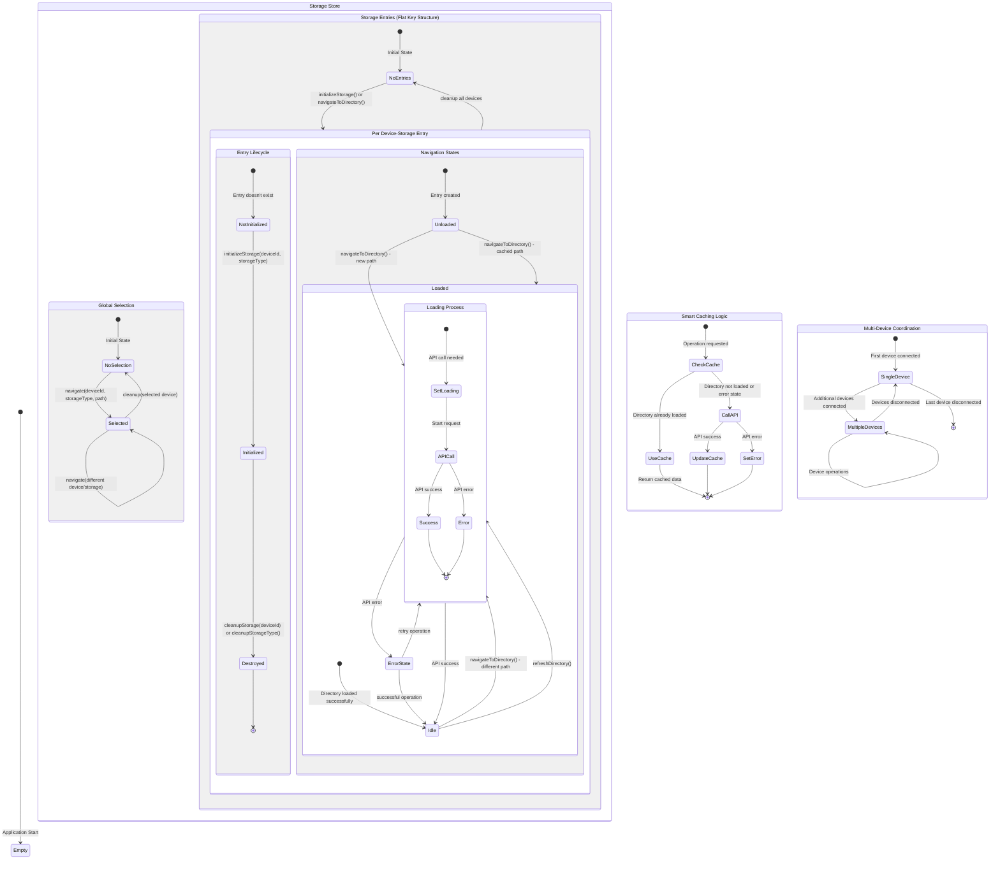

# Storage State Machine Comprehensive Model

This document describes the complete state machine for the TeensyROM Storage domain, capturing all possible state transitions and behaviors across the entire system.

## Overview

The storage state machine models a dual-state architecture:

- **Local Storage State**: Individual device-storage entries with independent navigation
- **Global Selection State**: Single selected directory across all devices for UI highlighting

## Complete State Machine



## Detailed State Definitions

### Entry States (Per Device-Storage)

| State                    | Properties                                                                            | Description                                     |
| ------------------------ | ------------------------------------------------------------------------------------- | ----------------------------------------------- |
| **NotInitialized**       | Entry doesn't exist                                                                   | No storage entry for device-storage combination |
| **Initialized/Unloaded** | `currentPath: '/', isLoaded: false, isLoading: false, directory: null, error: null`   | Entry created but no directory loaded           |
| **Loading**              | `isLoading: true, error: null`                                                        | API request in progress                         |
| **Loaded/Idle**          | `isLoaded: true, isLoading: false, directory: StorageDirectory, lastLoadTime: number` | Directory successfully loaded and cached        |
| **Error**                | `isLoading: false, error: string, directory: null or preserved`                       | API request failed                              |

### Global Selection States

| State           | Properties                                           | Description                                |
| --------------- | ---------------------------------------------------- | ------------------------------------------ |
| **NoSelection** | `selectedDirectory: null`                            | No directory selected globally             |
| **Selected**    | `selectedDirectory: { deviceId, storageType, path }` | One directory selected for UI highlighting |

## State Transitions

### 1. Initialize Storage Entry

```
Trigger: initializeStorage({ deviceId, storageType })
Conditions: Entry doesn't exist
State Changes:
  - Create entry: NotInitialized → Initialized/Unloaded
  - Set initial state: currentPath='/', isLoaded=false, isLoading=false
```

### 2. Navigate to Directory

```
Trigger: navigateToDirectory({ deviceId, storageType, path })
Always:
  - Update global selection: * → Selected

If entry doesn't exist:
  - Create entry inline: NotInitialized → Loading

If cached directory exists (same path, loaded, no error):
  - No API call: Loaded/Idle → Loaded/Idle

If API call needed:
  - Start loading: Unloaded/Loaded/Error → Loading
  - API success: Loading → Loaded/Idle
  - API error: Loading → Error
```

### 3. Refresh Directory

```
Trigger: refreshDirectory({ deviceId, storageType })
Conditions: Entry must exist
State Changes:
  - Start loading: Loaded/Idle/Error → Loading
  - API success: Loading → Loaded/Idle (preserve directory on error)
  - API error: Loading → Error (preserve existing directory)
```

### 4. Cleanup Storage

```
Trigger: cleanupStorage({ deviceId })
State Changes:
  - Remove all device entries: Any → Destroyed → NotInitialized
  - Clear global selection if matches: Selected → NoSelection (if needed)

Trigger: cleanupStorageType({ deviceId, storageType })
State Changes:
  - Remove specific entry: Any → Destroyed → NotInitialized
  - Clear global selection if matches: Selected → NoSelection (if needed)
```

## Smart Caching Behavior

The state machine implements intelligent caching:

1. **Cache Check**: Before API calls, verify if directory is already loaded

   - `existingEntry.currentPath === targetPath`
   - `existingEntry.isLoaded === true`
   - `existingEntry.directory !== null`
   - `existingEntry.error === null`

2. **Cache Hit**: Use existing data, no state transition
3. **Cache Miss**: Execute API call and update state

## Error Handling Patterns

1. **Navigation Errors**: Clear directory, preserve entry structure
2. **Refresh Errors**: Preserve existing directory, set error flag
3. **API Timeout/Network**: Transition to error state, allow retry
4. **Invalid Device**: Entry cleanup on device disconnection

## Multi-Device Coordination

- Each device-storage maintains independent state
- Global selection can point to any device-storage combination
- Cleanup operations affect only specified device/storage entries
- Selection automatically clears when selected device is cleaned up

## Key Implementation Notes

1. **Flat State Structure**: Uses `${deviceId}-${storageType}` keys for O(1) lookups
2. **Dual-State Architecture**: Local navigation + global selection
3. **Smart Caching**: Prevents redundant API calls
4. **Error Resilience**: Preserves data where possible during errors
5. **Multi-Device Support**: Independent state per device-storage combination

## State Machine Validation

This state machine ensures:

- ✅ No orphaned states or unreachable transitions
- ✅ Consistent error handling across all operations
- ✅ Proper cleanup on device disconnection
- ✅ Cache coherency and performance optimization
- ✅ Multi-device independence with global selection coordination
