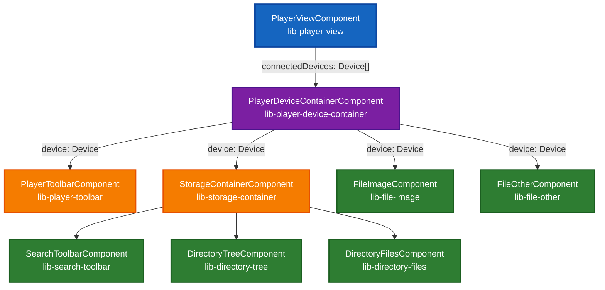
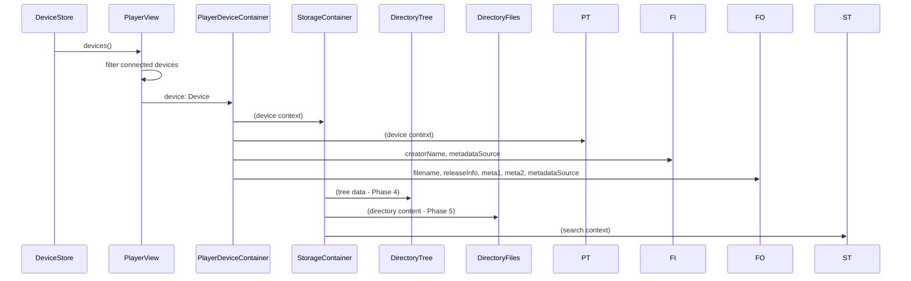

# Player Feature Component Structure

This document provides a visual overview of the Player feature component hierarchy, showing the relationships between components and their input/output properties.

## Component Hierarchy



## Data Flow



## File Structure

```
libs/features/player/src/lib/player-view/
├── player-view.component.ts              # Root component
├── player-device-container/
│   ├── player-device-container.component.ts  # Device container
│   ├── player-toolbar/                   # Device actions
│   ├── file-image/                       # Image file display
│   ├── file-other/                       # Generic file display
│   └── storage-container/                # Storage coordinator
│       ├── storage-container.component.ts
│       ├── search-toolbar/               # Search interface
│       ├── directory-tree/               # Navigation tree
│       └── directory-files/              # File listing
```
